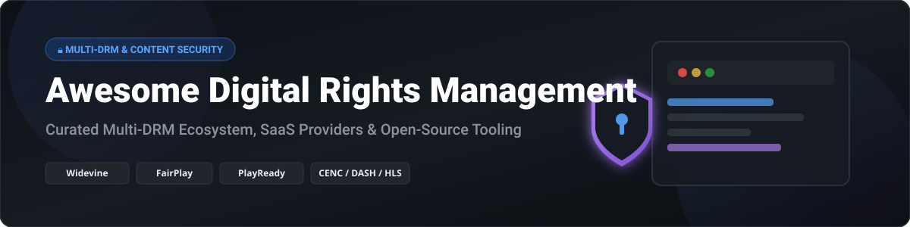

  

# 🔒 Awesome Digital Rights Management (DRM)

  
  
  
  
  

## 💡 Top Digital Rights Management (DRM) Ecosystem

**Curated List of SaaS Products, Multi-DRM Licensing Providers & Open-Source Media Security Projects** 🚀

*Focused on Multi-DRM Licensing (Google Widevine, Microsoft PlayReady, Apple FairPlay), Secure Video Packaging (CENC, DASH, HLS), Encrypted Media Extensions (EME), and OTT Content Protection*

> 📌 **Last updated: October 2026**

This repository tracks notable **SaaS platforms** and **open-source GitHub projects** for **Digital Rights Management (DRM)** in streaming media and OTT distribution. These security systems encrypt premium video assets, manage license proxies, issue license keys, and enforce strict playback security policies across web browsers, smart TVs, mobile apps, and set-top boxes.

---

## 📑 Table of Contents

- [📊 Sector Market Overview & Dynamics](#-sector-market-overview--dynamics)
- [🏢 SaaS/Hosted Platforms](#-saashosted-platforms)
- [💻 Open-Source GitHub Projects](#-open-source-github-projects)
- [🤝 How to Contribute](#-how-to-contribute)
- [💖 Support & Sponsorship](#-support--sponsorship)
- [⚠️ Disclaimer](#%EF%B8%8F-disclaimer)
- [📈 Star History](#-star-history)

---

## 📊 Sector Market Overview & Dynamics

> 🌐 **Market Size & Forecast**: The global Digital Rights Management (DRM) market in media, streaming, and entertainment is estimated at **~$3.2 Billion (2025/2026)** and is projected to reach **~$6.7 Billion by 2033** (CAGR of ~10.2%).
> 
> 🧩 **Market Concentration & Structure**: The DRM sector is **moderately fragmented**, with market share split between security conglomerates (NAGRA, Irdeto, Verimatrix) and specialized cloud multi-DRM license services (BuyDRM, EZDRM, PallyCon, Axinom, CastLabs). While **Google (Widevine)**, **Microsoft (PlayReady)**, and **Apple (FairPlay)** hold an oligopoly over underlying Content Decryption Modules (CDMs) and licensing specifications, the commercial license delivery & anti-piracy proxy layer is not a "winner-take-all" market and continues to support thriving independent SaaS vendors.

---

## 🏢 SaaS/Hosted Platforms

The table below ranks commercial SaaS Multi-DRM providers by estimated company size / annual revenue (descending order).

| Company / Platform | Estimated Size / Revenue | Description | Starting Price | Free Tier / Trial Limit |
| --- | --- | --- | --- | --- |
| **[NAGRA](https://lab.nagra.com/)** 🛡️ | **~$282M/yr** (Kudelski Digital Security) | Security and Multi-DRM platform for premium broadcast, studio, and tier-1 OTT services. | $850/month (AWS Marketplace Base Plan, includes 100,000 licenses) | 30-day free trial limited to 1,000 licenses |
| **[Irdeto](https://irdeto.com/)** 🔐 | **~$127M – $267M/yr** (Naspers sub) | Enterprise content security, DRM Control, piracy tracking, and cybersecurity ecosystem. | Custom enterprise quote based on service scope & traffic volume | Tailored pilot evaluation upon request |
| **[Verimatrix](https://www.verimatrix.com/)** 📡 | **~$41M – $46M/yr** (Euronext: VMX) | Streamkeeper Multi-DRM and enterprise end-to-end media content protection platform. | Elastic usage-based enterprise tier pricing | Evaluation trial environment available upon sales consultation |
| **[Axinom DRM](https://www.axinom.com/)** ⚙️ | **~$16.5M/yr** (Private) | Pay-as-you-go Multi-DRM service built on the cloud-native Axinom Mosaic platform. | Metered usage based on monthly license consumption | 60-day free trial with 2 free development environments |
| **[CastLabs (DRMtoday)](https://castlabs.com/)** 🎬 | **~$4.9M/yr** (Private) | Multi-DRM licensing, encoding, packaging, and player security infrastructure. | $299/month (Starter plan, includes first 20,000 license requests) | Free trial including first 1,000 free license requests (no credit card required) |
| **[BuyDRM](https://www.buydrm.com/)** 🔑 | **~$1.4M/yr** (Private) | Multi-DRM (KeyOS) license platform for Widevine, PlayReady, and FairPlay. | $99/month (entry pool tier) | No self-service free tier/trial (demo via sales consultation) |
| **[PallyCon](https://pallycon.com/)** ☁️ | **~$1M – $5M/yr** (Private estimate) | Cloud-based Multi-DRM license service and forensic watermarking for OTT platforms. | $299/month (Standard plan, includes up to 20,000 licenses) | 30-day free trial period for integration testing |
| **[EZDRM](https://www.ezdrm.com/)** ⚡ | **~$1M – $5M/yr** (Private estimate) | Hosted Multi-DRM offering Clear Key, single DRM, and Universal DRM plans. | $49.99/month (AES Clear Key, 10k licenses) / $99.99/month (Single DRM) | 30-day free Proof of Concept (POC) trial with 1,000 free licenses |
| **[ExpressPlay](https://www.expressplay.com/)** 🛡️ | Private / Intertrust Tech | Intertrust Multi-DRM platform supporting PlayReady, Widevine, FairPlay, and Marlin. | Custom enterprise quotes / volume licensing | 90-day free developer evaluation trial |
| **[Vualto (JW Player Studio DRM)](https://vualto.com/)** 📺 | Enterprise / JW Player | Enterprise DRM and packaging pipeline integrated into JW Player OTT stack. | Custom enterprise subscription quote | Custom evaluation demo upon request |

---

## 💻 Open-Source GitHub Projects

> 💡 **Open-source emphasis**: Production multi-DRM (Widevine, PlayReady, FairPlay) relies on proprietary hardware/browser CDMs by design. Open-source tools excel at **video packaging** (Shaka Packager, Bento4, FFmpeg), **adaptive playback** (Shaka Player, HLS.js, Video.js, dash.js), and **Clear Key** test workflows.

The open-source repositories below are sorted by GitHub_Stars_Count (descending order). Each Stars_Badge links directly to that repository's stargazers page.

| Project Name | GitHub_Stars_Count | Description & Category |
| --- | --- | --- |
| **[FFmpeg](https://github.com/FFmpeg/FFmpeg)** 🎥 |  | Universal multimedia framework supporting CENC encryption, DASH/HLS packaging, and DRM key preparation. |
| **[Video.js](https://github.com/videojs/video.js)** 🌐 |  | HTML5 web video player framework with `videojs-contrib-eme` plugin for Multi-DRM browser playback. |
| **[hls.js](https://github.com/video-dev/hls.js)** 📺 |  | JavaScript HLS client implementing EME interface for FairPlay and Widevine encrypted HLS streams. |
| **[Shaka Player](https://github.com/shaka-project/shaka-player)** ⏯️ |  | Google open-source adaptive media player with native support for EME, Widevine, PlayReady, and FairPlay CDMs. |
| **[dash.js](https://github.com/Dash-Industry-Forum/dash.js)** ⚡ |  | Official DASH Industry Forum reference player demonstrating EME/CENC Multi-DRM integration patterns. |
| **[GPAC / MP4Box](https://github.com/gpac/gpac)** 📦 |  | Modular open-source multimedia framework for MP4 packaging, CENC encryption, and DASH/HLS generation. |
| **[Shaka Packager](https://github.com/shaka-project/shaka-packager)** 🛠️ |  | Leading media packaging tool for DASH/HLS with Common Encryption (CENC), Clear Key, and multi-DRM PSSH injection. |
| **[Bento4](https://github.com/axiomatic-systems/Bento4)** 🧩 |  | Open C++ MP4/DASH toolkit widely used for video encryption, key formatting, and DRM-ready content packaging. |

---

## 🛠️ Key Architectural Components for Custom DRM Systems

- **Media Packaging**: Use **Shaka Packager**, **Bento4**, **GPAC MP4Box**, or **FFmpeg** to encode and encrypt video into DASH (fMP4) or HLS (TS/fMP4) using Common Encryption (CENC - `cenc`, `cbcs`).
- **License Server / Proxy**: Integrate commercial Multi-DRM services (BuyDRM, Axinom, EZDRM, PallyCon, CastLabs) to generate signed DRM licenses for Google Widevine Modular, Microsoft PlayReady, and Apple FairPlay Streaming.
- **Client Playback**: Use **Shaka Player**, **hls.js**, **dash.js**, or **Video.js** with EME (Encrypted Media Extensions) to handle license challenges and secure CDM decryption in browsers and applications.

---

## 🤝 How to Contribute

Contributions are warmly welcomed! Help us keep this curated list up to date and comprehensive:

1. 🍴 **Fork** this repository.
2. 📝 Add or update entries in `README.md` (following the existing table layout and formatting).
3. 🔍 Ensure descriptions are objective and include official documentation links.
4. 🚀 Open a **Pull Request** with a clear explanation of your changes.

---

## 💖 Support & Sponsorship

If you found this repository helpful for your video engineering, content security, or OTT projects, please consider supporting the project!

- ⭐ **Star this repository** to help others discover it on GitHub.
- 🔄 **Fork and share** with fellow OTT engineers and media platform builders.
- ☕ **Buy me a coffee / Sponsor**: Support ongoing maintenance on the [GitHub Sponsor Dashboard](https://github.com/sponsors/ishandutta2007).

Thank you for being part of the open media engineering community! 🙌

---

## ⚠️ Disclaimer

- This is a **community-curated list** — provided for informational and educational purposes only.
- Circumventing DRM or redistributing proprietary Content Decryption Modules (CDMs)/license keys is illegal in many jurisdictions. Only use DRM tooling on media content you own or are legally licensed to protect.
- Commercial multi-DRM license ecosystem integration remains mandatory for premium Hollywood studio distribution and compliance.

---

## 📈 Star History

---

  <b>Made with ❤️ for OTT Engineers, Media Developers & Content Security Professionals</b>

